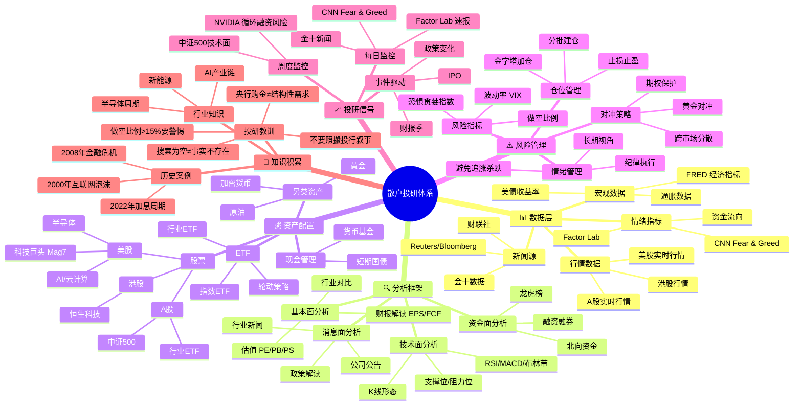

# StocKlaw 投研知识图谱

## 散户投研能力评估

### ✅ 已具备的能力

| 维度 | 能力 | 来源 |
|------|------|------|
| **数据层** | 美股实时行情 | moomoo API |
| **数据层** | 宏观数据 | FRED |
| **数据层** | 情绪指标 | CNN Fear & Greed、Factor Lab |
| **数据层** | 新闻源 | 金十数据、Google News |
| **分析框架** | 基本面分析 | analyze.py |
| **分析框架** | 技术面分析 | yfinance + 手动计算 |
| **资产配置** | 美股个股 | 持仓监控 |
| **资产配置** | ETF | 中证500监控 |
| **风险管理** | 仓位管理 | 分批建仓策略 |
| **风险管理** | 风险指标 | 恐惧贪婪指数 |
| **投研信号** | 每日监控 | Factor Lab、FNG |
| **投研信号** | 周度监控 | NVIDIA风险、中证500 |
| **知识积累** | 历史案例 | 知乎文章分析 |
| **知识积累** | 投研教训 | MEMORY.md |

### ❌ 缺失的能力

| 维度 | 缺失能力 | 重要性 | 建议 |
|------|---------|--------|------|
| **数据层** | A股实时行情 | ⭐⭐⭐ | 接入新浪/腾讯API |
| **数据层** | 资金流向 | ⭐⭐⭐ | 北向资金、融资融券 |
| **数据层** | 期权数据 | ⭐⭐ | Put/Call比率、隐含波动率 |
| **分析框架** | 量化回测 | ⭐⭐⭐ | backtrader 策略验证 |
| **分析框架** | 财报自动化 | ⭐⭐ | 财报数据自动提取 |
| **资产配置** | 债券分析 | ⭐⭐ | 美债收益率曲线 |
| **资产配置** | 另类资产 | ⭐ | 加密货币、商品期货 |
| **风险管理** | 期权对冲 | ⭐⭐⭐ | 保护性看跌期权 |
| **风险管理** | 相关性分析 | ⭐⭐ | 资产相关性矩阵 |
| **风险管理** | 压力测试 | ⭐⭐ | 极端情景模拟 |
| **投研信号** | 实时预警 | ⭐⭐ | 价格/指标突破提醒 |
| **投研信号** | 财报日历 | ⭐⭐ | 自动跟踪财报日期 |
| **知识积累** | 回测验证 | ⭐⭐⭐ | 策略历史表现 |
| **知识积累** | 错误复盘 | ⭐⭐ | 交易记录分析 |

## 优先级建议

### 🔴 高优先级（必须补齐）

1. **A股实时行情** — 目前AKShare被封，需要接入新浪/腾讯API
2. **期权对冲** — 散户最重要的风险保护工具
3. **量化回测** — 验证策略有效性，避免"纸上谈兵"
4. **资金流向数据** — 北向资金、融资融券是重要的市场情绪指标

### 🟡 中优先级（建议补齐）

5. **相关性分析** — 资产配置的基础
6. **财报自动化** — 提高分析效率
7. **实时预警** — 抓住交易机会
8. **错误复盘** — 从失败中学习

### 🟢 低优先级（锦上添花）

9. **加密货币分析** — 如果感兴趣
10. **压力测试** — 极端情景准备

## 总结

**当前水平：70分**

- 数据层：80分（美股数据完善，A股缺失）
- 分析框架：70分（基本面强，技术面弱，量化缺失）
- 资产配置：60分（股票为主，债券和另类资产弱）
- 风险管理：65分（有意识，但工具不足）
- 投研信号：75分（每日监控完善，实时预警缺失）
- 知识积累：80分（有系统记录，但缺回测验证）

**最关键的3个短板**：
1. 期权对冲能力（保护持仓）
2. 量化回测能力（验证策略）
3. A股数据接入（扩大能力圈）
